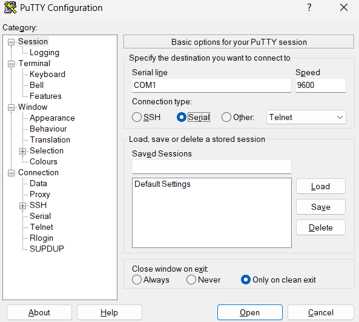
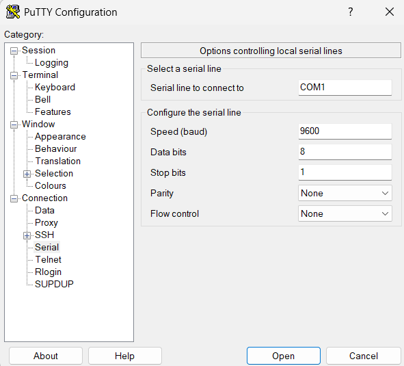

# PuTTY Serial Setup

## Overview

PuTTY is used to send UART (RS232/USB-Serial) data from the PC to the FPGA. The FPGA receives this data through the UART RX pin.

---

## Connection

* Connect **PC → FPGA** using USB (USB-UART interface on board)
* This creates a **virtual COM port** on the PC

Check the COM port:

* Open Device Manager
* Go to `Ports (COM & LPT)`
* Note the port (e.g., COM3, COM4)

---

## PuTTY Configuration

Open PuTTY and configure as follows:

### Step 1: Session Settings



* Connection type → **Serial**
* Serial line → **COMx** (from Device Manager)
* Speed → **9600**

---

### Step 2: Serial Settings

Go to: `Connection → Serial`



Set:

* Baud rate → 9600
* Data bits → 8
* Stop bits → 1
* Parity → None
* Flow control → None

---

## Start Communication

* Click **Open**
* A terminal window will appear
* Type characters from keyboard
* Press **ENTER** to send newline (`0x0D`)

---

## Expected Behavior

* Each key press sends ASCII data to FPGA
* FPGA processes the input
* On ENTER, the processed value is displayed on hardware (e.g., 7-segment displays)

---

## Notes

* Baud rate must match FPGA design (9600)
* Incorrect COM port will result in no communication
* ENTER key is required to trigger final output

# UART Hex Display System (FPGA)

## Overview

This project implements a UART-based input system on FPGA. Data is sent from a PC using a serial terminal and processed on the FPGA. The system accepts hexadecimal characters, converts them into a 16-bit value, and displays the result on four seven-segment displays.

---

## Functionality

* The user types hexadecimal characters (`0–9`, `A–F`) from the keyboard.
* The FPGA continuously stores the **last four valid hexadecimal digits**.
* When the ENTER key is pressed, the stored value is latched.
* The final 16-bit value is displayed on four seven-segment displays.

---

## Expected Output

Example:

Input typed:

```
123ABC
```

After pressing ENTER:

```
Display shows: 3ABC
```

Each digit appears on one seven-segment display:

* HEX3 → most significant digit
* HEX0 → least significant digit

---

## File Descriptions

### `uart_rx_minimal.v`

Implements a UART receiver. Converts serial input into 8-bit parallel data and generates a valid signal when a byte is received.

---

### `uart_with_led.v`

Simple test module. Displays received ASCII data directly on LEDs to verify UART communication.

---

### `uart_hex_display_top.v`

Top-level module.

* Filters valid hexadecimal characters
* Stores the last four digits
* Detects ENTER key
* Converts ASCII to hexadecimal
* Drives the seven-segment displays

---

## Serial Setup (PuTTY)

Use PuTTY with the following settings:

* Connection type: Serial
* COM port: (from Device Manager)
* Baud rate: 9600
* Data bits: 8
* Stop bits: 1
* Parity: None
* Flow control: None

Typing characters sends ASCII data to the FPGA. Pressing ENTER triggers the display update.

---

## Summary

The system demonstrates UART communication, ASCII-to-hex conversion, buffering of input data, and real-time display on FPGA hardware.
